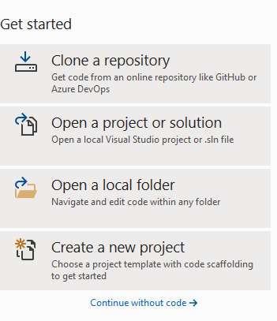
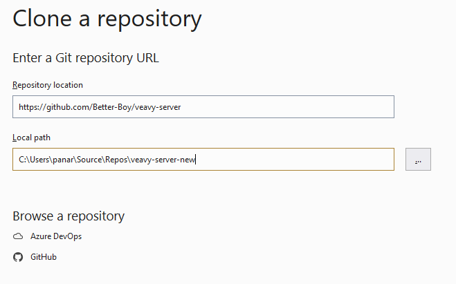
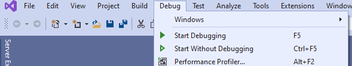
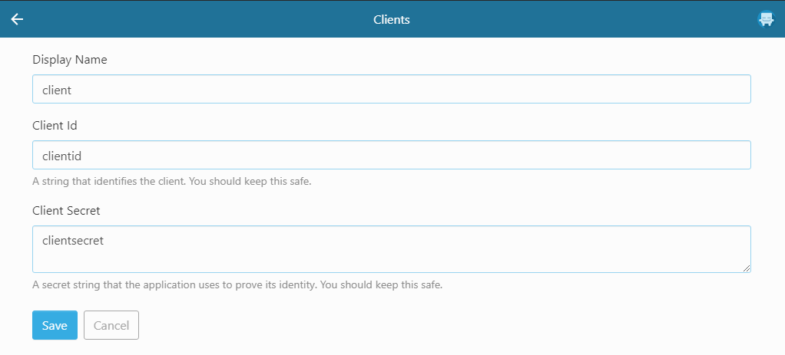

# Weavy Solution

This repository is a fork from https://github.com/davekoncsol/weavy-hackathon-tasks.

## Prerequisites installation:

1. Install [Visual Studio](https://visualstudio.microsoft.com/)
2. Install [Microsoft SQL Server Management Studio](https://docs.microsoft.com/en-us/sql/ssms/download-sql-server-management-studio-ssms?view=sql-server-ver15)

## Installation:

1. Start the Microsoft SQL Server Management Studio
2. Create a new Database with name "**weavy**"
3. Start the Visual Studio
4. Select "Clone a repository"

1. Give the url of this repo i.e https://github.com/Better-Boy/veavy-server

1. Once the repo is ready ---> Click on "Debug ---> Start Without Debugging"

1. A browser tab should open with weavy login
1. Once you login, head over to "/manage" and create a new client with "Client Id" as "clientid" and "Client Secret" as "clientsecret"

For complete detailed video, refer - https://www.youtube.com/watch?v=T4k3bAES2Rk&ab_channel=WeavyCollaborationHack2020